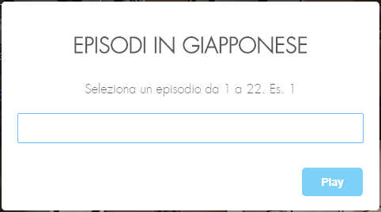
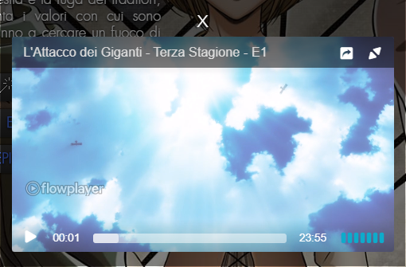

# VVVVID Streaming

> Ti permette di guardare i video su VVVVID.it senza pubblicità.

## Installazione

Step 1: Gestore di script utente

- Chrome: [Tampermonkey](https://chrome.google.com/webstore/detail/tampermonkey/dhdgffkkebhmkfjojejmpbldmpobfkfo) o [Violentmonkey](https://chrome.google.com/webstore/detail/violentmonkey/jinjaccalgkegednnccohejagnlnfdag)

- Firefox: [Greasemonkey](https://addons.mozilla.org/en-GB/firefox/addon/greasemonkey/), [Tampermonkey](https://addons.mozilla.org/en-GB/firefox/addon/tampermonkey/) o [Violentmonkey](https://addons.mozilla.org/en-GB/firefox/addon/violentmonkey/)

- Safari: [Tampermonkey](https://www.tampermonkey.net/?browser=safari)

- Microsoft Edge: [Tampermonkey](https://www.microsoft.com/it-it/p/tampermonkey/9nblggh5162s?rtc=1&activetab=pivot:overviewtab)

- Opera: [Tampermonkey](https://addons.opera.com/en-gb/extensions/details/tampermonkey-beta/) o [Violentmonkey](https://addons.opera.com/extensions/details/violent-monkey/)

- Maxthon: [Violentmonkey](http://extension.maxthon.com/detail/index.php?view_id=1680)

- Dolphin: [Tampermonkey](https://play.google.com/store/apps/details?id=net.tampermonkey.dolphin)

- UC: [Tampermonkey](https://play.google.com/store/apps/details?id=net.tampermonkey.uc)

Step 2: Installa Script utente

- [Greasefork](https://greasyfork.org/en/scripts/391506-vvvvid-streaming)
- [Github](https://github.com/Nearata/vvvvid-streaming/raw/master/vvvvid-streaming.user.js)

## Esempio di utilizzo

Prenderò come esempio L'Attacco dei Giganti - Terza stagione

Dopo aver aperto la pagina, e una volta finito il caricamento, vi si creeranno due bottoni sotto la trama:

Una volta scelto e cliccato il bottone, vi si aprirà un popup:

Una volta scelto l'episodio e premuto INVIO o cliccando su play, vi si aprirà il player:

Per mettere fullscreen, cliccate il tasto in altro a destra del player. Per uscire dal fullscreen premete ESC.

## Changelog

- 1.0.1
  - Aggiunto il titolo della versione selezionata sul popup
- 1.0
  - Primo rilascio

## Meta

Distribuito sotto la licenza MIT. Vedi ``LICENSE`` per maggiori informazioni.
