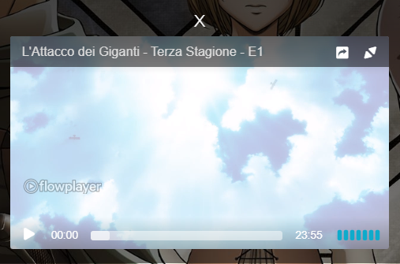
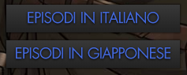

# VVVVID Streaming

> Utilizza un player esterno per bypassare la pubblicità su VVVVID

## Installazione

**Attenzione**: Per utilizzare questo script, hai bisogno di un gestore di script utente (alcuni esempi sono `Violentmoneky` o `Tampermonkey`).

- [Greasefork](https://greasyfork.org/en/scripts/391506-vvvvid-streaming) - segui le istruzioni presenti sul sito.
- [GitHub](https://github.com/Nearata/vvvvid-streaming/raw/master/vvvvid-streaming.user.js) - ti verrà chiesto di confermare l'installazione.

## Come funziona

All'apertura della pagina di un anime, vi compariranno dei bottoni "extra".

Esempio:

Clicca uno dei tasti e segui le istruzioni a schermo.

## Scorciatoie del Player

- ESC: Esci dal fullscreen o chiudi un menu selezionato
- Barra spaziatrice: Play / Pausa
- M: Muta / Smuta
- F: Attiva / Disattiva fullscreen
- Freccia su o K: Alza volume
- Freccia giù o J: Abbassa volume
- Freccia sinistra o H: Torna indietro
- Freccia destra o L: Vai avanti

Per maggiori informazioni, visita [https://flowplayer.com/developers/plugins/keyboard](https://flowplayer.com/developers/plugins/keyboard)

## License

Distribuito sotto la licenza MIT. Vedi `LICENSE` per maggiori informazioni.
